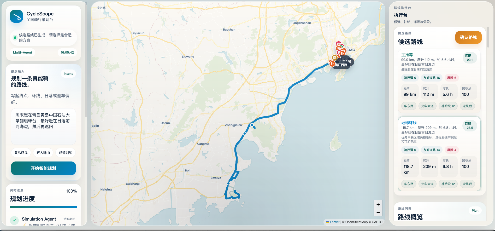

# CycleScope

<p>
  
  
  
  
  
</p>

CycleScope 是一个面向真实骑行场景的多智能体路线策划台。它不是简单的「LLM 生成路书」Demo，而是把自然语言理解、地点坐标控制、真实路网、天气、POI、骑行路权策略和交互式地图融合在一起，生成更接近真实可执行的骑行方案。



## 项目介绍

很多路线规划系统会把大模型当成万能地图使用，结果很容易出现起终点识别错误、自然语言片段被当成地名、环线或训练路线被随意拼接等问题。CycleScope 的核心思路是把「语言理解」和「地图事实」拆开：先把用户需求解析成结构化路线参数，再做坐标核验，最后进入真实路网规划、风险评分和路书生成。

项目采用 LangGraph 编排多智能体工作流，结合 OpenAI Function Calling 格式的需求解析、MCP 工具层、OSM 生态开放数据和交互式前端工作台，让用户可以从一句口语化需求出发，得到可比较、可修正、可确认的骑行路线。

它适合处理这样的需求：

```text
山东科技大学到星光岛，尽量走自行车道
青岛环大珠山骑行，最好最后能看日落，尽量别走大车多的路
帮我规划上海周围100km的骑行线路，尽量风景好一点，少走大车路
中国石油大学华东唐岛湾校区到星光岛看日落再返回
```

## 功能实现

- **自然语言路线规划**：支持点到点、往返、环线、训练路线、看日落、少走大车路、优先自行车道等口语化需求。
- **起终点与途经点核验**：系统会把地点名解析为真实坐标，并通过本地锚点、线路预设和候选评分降低定位偏差。
- **候选路线生成与比较**：生成多条候选路线，展示距离、预计耗时、爬升、卡路里、难度、风险命中和路线匹配度。
- **地图可视化**：主地图展示路线轨迹、关键点和当前选中方案，用户可以直观看到路线走向。
- **右侧执行侧栏**：集中展示候选路线卡片、路线概览、识别到的约束、天气、补给/景点/厕所等 POI、道路特征、分段路书和执行建议。
- **人工修正入口**：支持手动输入或地图点选起点、终点、途经点，再基于修正后的信息重新规划。
- **最终专业路书**：用户确认路线后，系统会补充社区情报、安全提醒、补给建议、时间窗口和分段说明，生成可执行路书。

## 技术亮点

- **OpenAI Function Calling 需求解析**：`demand_parser_node` 使用 OpenAI tools / function calling 格式定义 `parse_cycling_demand`，把口语需求稳定转成 `route_mode`、`origin`、`destination`、`route_points`、`target_distance_km` 等可执行参数。
- **坐标控制优先**：`coordinate_control_node` 会先核验起终点和途经点，再进入路由；本地锚点、线路预设、Nominatim 候选评分共同降低地点漂移。
- **MCP 工具层**：主链路优先通过 MCP 调用 `get_cycling_route`、`get_weather`、`search_pois_osm`、`get_elevation`，并在 MCP 不可用时回退到 httpx 直连。
- **真实世界数据闭环**：OSRM、Open-Meteo、Overpass、Nominatim、Open-Elevation、DuckDuckGo Search 共同支撑路线、天气、POI、海拔和社区情报。
- **骑行策略评分**：候选路线会按自行车道、绿道、景观路加权，并对高速、快速路、高架、隧道、禁行道路、大车道路降权。
- **多智能体可解释流程**：需求解析、意图研究、区域分析、坐标控制、候选规划、数据执行、路权策略、生活方式评估、物理推演和解释节点分层协作。
- **SSE 流式反馈**：前端实时接收每个节点的执行状态，让复杂规划过程可观察、可调试。

## 系统架构


## 目录结构

```text
.
├── main.py                    # FastAPI 服务入口与 SSE 流式接口
├── requirements.txt           # Python 依赖
├── static/
│   ├── index.html             # 前端页面
│   ├── script.js              # 地图、交互和 SSE 客户端逻辑
│   └── style.css              # 工作台视觉样式
├── workflow/
│   ├── graph.py               # LangGraph 多智能体拓扑
│   ├── nodes.py               # 核心节点实现
│   ├── route_knowledge.py     # 本地路线预设、别名、锚点
│   ├── state.py               # 图状态定义
│   ├── llm.py                 # Qwen / DashScope LLM 配置
│   ├── cache.py               # 外部接口缓存
│   └── rag.py                 # 路书阶段情报增强
└── assets/
    └── cyclescope-interface.png
```

## 快速开始

### 1. 安装依赖

建议使用 Python 3.10 或更高版本。

```bash
python3 -m venv .venv
source .venv/bin/activate
pip install -r requirements.txt
```

### 2. 配置模型密钥

项目使用 DashScope 兼容 OpenAI SDK 的 Qwen 模型。请在本地创建 `.env` 文件：

```bash
DASHSCOPE_API_KEY=你的 DashScope API Key
```

`.env` 已被 `.gitignore` 排除，不应该提交到仓库。

### 3. 启动服务

```bash
python3 main.py
```

默认会优先使用 `127.0.0.1:8000`。如果端口被占用，服务会自动切换到后续端口，并在终端打印可点击 URL。

### 4. 打开页面

```text
http://127.0.0.1:8000/
```

如果终端提示切换到了其他端口，例如 `8002`，则访问：

```text
http://127.0.0.1:8002/
```

## API

### 流式生成候选路线

```http
POST /api/v1/stream_plan
Content-Type: application/json
```

请求体：

```json
{
  "intent": "帮我规划上海周围100km的骑行线路，尽量风景好一点，少走大车路。",
  "user_id": "default_user"
}
```

接口通过 SSE 返回每个节点的进度。当 `explainability` 节点完成后，会返回 `routes_ready`，其中包含候选路线、天气、POI、风险评分和摘要分析。

### 确认路线并生成最终路书

```http
POST /api/v1/stream_finalize
Content-Type: application/json
```

请求体：

```json
{
  "thread_id": "stream_plan 返回的会话 ID",
  "route_id": "route_0"
}
```

## 设计原则

- **LLM 做理解，不猜地图事实**：模型负责解析、骨架规划和解释；坐标、路网、天气、POI 交给真实数据源。
- **先锁地点，再算路线**：地点无法可靠解析时，系统宁可提示修正，也不生成看似完整的假路线。
- **环线按骑行语义组织**：抽象环线先匹配本地预设、区域锚点和目标距离，再进入路由器。
- **自动规划保留人工介入**：地图点选和手动修正始终可用，方便用户把路线拉回真实需求。

## 当前能力边界

- OSRM 公共服务对部分区域的自行车路由覆盖不稳定，系统会尽量通过策略层降权风险道路。
- Nominatim 与 Overpass 依赖开放地图数据，个别小众地点可能缺失或坐标偏移。
- 社区情报搜索受网络环境影响，失败时会降级为本地知识和路线结构说明。
- 当前内置路线预设覆盖有限，后续可以持续扩展热门骑行城市和经典环线。

## License

建议以 MIT License 开源。发布前可以根据你的实际需求补充正式 `LICENSE` 文件。
